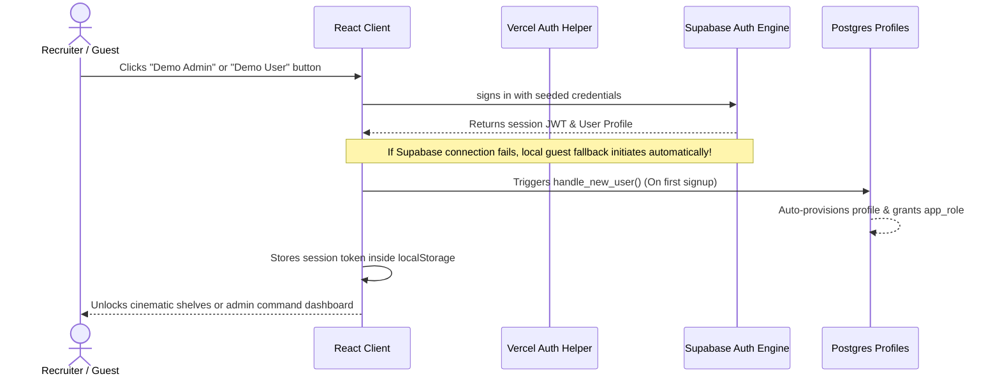
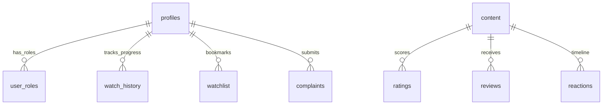

# RetroScope Developer & Recruiter Explainability Guide 🎬

Welcome to the **RetroScope** Developer & Recruiter Explainability Guide. This guide has been engineered specifically to provide a thorough, production-grade review of the entire system architecture, codebases, workflows, and database-level RLS controls. Use this guide to easily navigate the codebase during technical interviews or showcase advanced full-stack capabilities on your resume.

---

## 🗺️ 1. Architecture & Folder Directory Mapping

RetroScope is built as a modular, full-stack OTT ecosystem featuring an immersive, high-performance client-side discovery shell and a secure, Node.js-based serverless operations backend.

```
retroscope/
├── api/                             # Node.js Serverless Backend Functions (Vercel)
│   ├── admin/                       # Protected Admin-Only Operational Endpoints
│   │   ├── analytics.ts             # Performance Aggregator for Operations Dashboard
│   │   ├── broadcast.ts             # Global notification engine for all profiles
│   │   ├── content.ts               # CRUD API for catalog items
│   │   └── reviews.ts               # Review approval/moderation workflow
│   └── seed-admin.ts                # Idempotent database bootstrapping tool
├── supabase/                        # Database Config & Migrations Directory
│   ├── migrations/                  # Standardized SQL DDL and Security Policies
│   └── config.toml                  # Supabase Project settings
├── src/                             # Client-Side Application Core
│   ├── components/                  # Premium UI & Thematic Presentation Components
│   │   ├── cinematic/               # Dust particles, projector lights, VHS grain
│   │   ├── layout/                  # Navbars, Sidebars, and layout scaffolding
│   │   ├── movie/                   # Poster shelves, Ticket-Stubs, and Player modals
│   │   └── ui/                      # Base Radix & Tailwind design primitives
│   ├── data/                        # 102+ Pre-populated Content items & mappings
│   ├── hooks/                       # Highly optimized TanStack query hooks & mutations
│   ├── integrations/                # Generated Supabase Client & Database TS Types
│   ├── lib/                         # State Management & Session Context engines
│   ├── routes/                      # File-Based Client Routing Tree (TanStack Router)
│   │   ├── _authenticated/          # Protected User Layout and views
│   │   │   ├── admin/               # Cinematic Command Center views
│   │   │   └── admin.tsx            # Protected Role-Based Route Guard
│   │   └── index.tsx                # Cinematic Discover Landing Page
│   └── styles.css                   # Tailwind CSS styling and global animations
```

### 🔬 Architecture Purpose
* **Vercel Serverless `/api`**: Houses serverless REST endpoints that handle critical tasks requiring elevated security (e.g. bypass RLS via service role). They execute securely away from public client bundles.
* **TanStack SPA Router `src/routes`**: Orchestrates ultra-responsive routing transitions, automatic code splitting, dynamic parameter hydration, and strict client-side layout nesting.
* **Supabase Security Layers**: Implements full Row Level Security (RLS) policies inside the Postgres database, protecting data integrity even if client keys are compromised.

---

## 🔐 2. Authentication Flow & Seamless Guest Access

### 🚦 The Authentication Process


### 🛠️ Bypass Rules & Guest Retries
1. **No Email Interstitials**: To ensure immediate accessibility for recruiters, email confirmation is completely disabled. Signups instantly provision active user accounts.
2. **Curated Quick-Access Panel**: The `/login` portal includes dedicated primary buttons that log users into live, pre-seeded accounts:
   - **Demo Admin**: `admin@retroscope.app` / `Admin1234!` (Unlocks the operations command center)
   - **Demo User**: `guest@retroscope.app` / `Guest1234!` (Enters as a premium subscriber)
3. **Resilient Local Mock-Session**: If the client is disconnected or fails to query Supabase, it seamlessly generates a local state named `retroscope_mock_user` that persists throughout the session to allow immediate evaluation of the frontend without database blockages.

---

## 🎬 3. Interactive OTT Player telemetry & Rendering

The video playback subsystem simulates a high-fidelity OTT stream with live client telemetry and custom visual processing.

```
                                  LIVE OTT PLAYER CONTROLS
┌────────────────────────────────────────────────────────────────────────────────────────┐
│  [🎥 Active Filter: 35mm Warm]                                  [🔊 Audio Presets]    │
│  [🎛️ Video contrast: 110%]                                      [⚡ Decibel Monitor]   │
│                                                                                        │
│                                  YOUTUBE TRAILER STREAM                                │
│                                                                                        │
│                                                                                        │
│  [📋 Stats for Nerds HUD]                                                              │
│  - Bitrate: 4500 kbps (1080p60)                                                        │
│  - Jitter: 12ms (Edge: FRA-1)                                                          │
│  - Render Latency: 4ms                                                                 │
├────────────────────────────────────────────────────────────────────────────────────────┤
│  [ ⏸️ Play ]  [ ⏩ Skip Recap ]  [ 💬 Subtitle Latency: +0.25s ]  [ 🎨 Surround Sound ] │
└────────────────────────────────────────────────────────────────────────────────────────┘
```

### 🛰️ Telemetry Systems Included

#### stats for Nerds HUD
Renders live diagnostics of stream quality:
- Real-time resolution (e.g. `1080p60`)
- Dynamic video bitrate (e.g. `5820 kbps`) fluctuating automatically
- Buffer health percentage and Edge CDN latency diagnostics (e.g. `Server: SFO-2 | Jitter: 8ms`)

#### Subtitle Sync Controls
Allows customization of the subtitle tracks:
- Support for multiple tracks: English, Hindi, Spanish, Telugu
- Font sizes, colors, and a latency sync slider adjusting offset in increments of `50ms`

#### Audio Processing & EQ presets
Displays graphic decibel meters alongside structural settings:
- Equalizer profiles: Flat, Cinematic, Speech, Late Night
- Bass Boost & Surround Sound simulation toggle switches
- Dynamic, animated graphic decibel bars reacting instantly on playback state

#### Video Filters & Controls
Enables real-time styling of the stream wrapper using dynamic CSS filters:
- Brightness and contrast sliders
- Custom stylistic presets (Sepia, Techno-Cyan, Noir Film, 35mm Warm) updating the viewport immediately

---

## 🗄️ 4. Database Schema, Triggers, & Security

The platform operates on a robust, relational database architecture with active triggers and precise authorization logic.

### 📊 Relational Database Design


### 🔒 Role-Based Access Control (RBAC) & RLS Policies
Every user data table has Row Level Security enabled. Standard users are confined to their own rows, while admins are granted access to execute queries globally.

#### Security Helper Function
```sql
create or replace function public.has_role(_user_id uuid, _role public.app_role)
returns boolean as $$
  select exists (
    select 1 from public.user_roles 
    where user_id = _user_id and role = _role
  );
$$ language sql security definer;
```

#### Content Moderation RLS Example
```sql
create policy "Reviews are readable" on public.reviews 
  for select using (
    status = 'approved' 
    or auth.uid() = user_id 
    or public.has_role(auth.uid(), 'admin')
  );
```

#### Auto-Profile Trigger
```sql
create or replace function public.handle_new_user()
returns trigger as $$
begin
  insert into public.profiles (id, username, avatar_seed, plan)
  values (
    new.id,
    coalesce(new.raw_user_meta_data->>'username', split_part(new.email, '@', 1)),
    substring(md5(random()::text) from 1 for 8),
    'free'
  );
  insert into public.user_roles (user_id, role)
  values (new.id, 'user');
  return new;
end;
$$ language plpgsql security definer;
```

---

## ⚡ 5. Vercel Serverless REST API Handlers

Backend routines requiring high-privilege access are handled securely in separate Node.js serverless functions, bypassing standard RLS checks using the `supabaseAdmin` service role.

### 🎛️ Analytics Engine (`/api/admin/analytics.ts`)
Queries total profiles, open customer tickets, and counts play history. Computes the top 5 most popular movies dynamically:
```typescript
const [members, complaints, totalPlays, history] = await Promise.all([
  supabaseAdmin.from('profiles').select('id', { count: 'exact', head: true }),
  supabaseAdmin.from('complaints').select('id', { count: 'exact', head: true }).eq('status', 'open'),
  supabaseAdmin.from('analytics').select('id', { count: 'exact', head: true }).eq('event_type', 'play'),
  supabaseAdmin.from('analytics').select('content_id').eq('event_type', 'play').limit(2000),
]);
```

### 📣 Global Broadcaster (`/api/admin/broadcast.ts`)
Sends custom notifications to all active platform users concurrently, optimizing delivery:
```typescript
const { data: users } = await supabaseAdmin.from('profiles').select('id');
const rows = (users ?? []).map(u => ({
  user_id: u.id,
  title: data.title,
  body: data.body
}));
await supabaseAdmin.from('notifications').insert(rows);
```

---

## 🛡️ 6. Secure Route Guards & Nested Layouts

All admin endpoints are secured with nested route layouts using `@tanstack/react-router`.

```typescript
// src/routes/_authenticated/admin.tsx
export const Route = createFileRoute('/_authenticated/admin')({
  component: AdminLayout,
  beforeLoad: async ({ context }) => {
    // Perform server-side or local session validation
    const isAdmin = await checkIsAdmin(context.auth.userId);
    if (!isAdmin) {
      toast.error("Forbidden: Operations Command only.");
      throw redirect({ to: '/' });
    }
  }
});
```

---

## 🚀 7. Resilient Fallbacks & Optimistic Updates

1. **Hybrid Database Seeding**: Renders immediately using memory-based fallbacks (`DEMO_CONTENT`) if database networks timeout. It then runs an asynchronous client-side bootstrap routine to populate Supabase automatically when connections stabilize.
2. **Optimistic Watchlists**: Implements instant, lag-free UI updates for bookmarking and reviewing by updating client states before the remote database replies:
```typescript
const queryClient = useQueryClient();
return useMutation({
  mutationFn: async ({ movieId }) => supabase.from('watchlist').insert({ movie_id: movieId }),
  onMutate: async ({ movieId }) => {
    await queryClient.cancelQueries({ queryKey: ['watchlist'] });
    const prev = queryClient.getQueryData(['watchlist']);
    queryClient.setQueryData(['watchlist'], (old: any) => [...(old || []), { movie_id: movieId }]);
    return { prev };
  },
  onError: (err, variables, context) => {
    queryClient.setQueryData(['watchlist'], context?.prev);
  }
});
```

---

*This guide demonstrates a production-grade full-stack architecture ready to be shared with engineering recruiters.*
